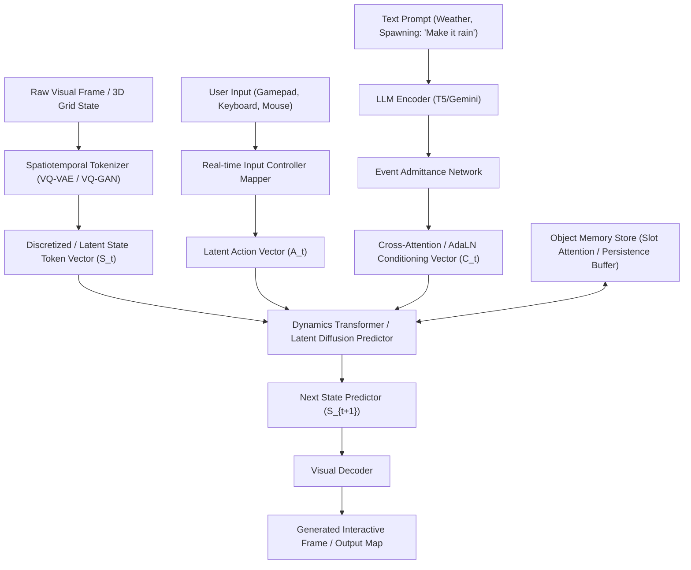
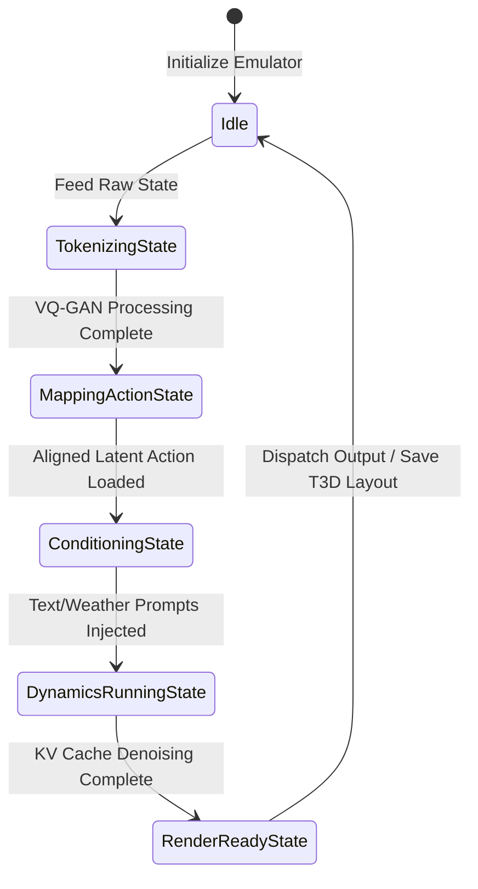

# Genie 3 Generative Interactive 3D World Model
## Design Specification and Rust-Based Emulator Architecture

This document provides a comprehensive design specification and architectural blueprint for integrating a generative world model emulator inspired by **Google DeepMind's Genie 3** into the [Rocket Craft](file:///Users/sac/rocket-craft/README.md) ecosystem. 

---

## 1. Executive Summary

**Genie 3** represents the state-of-the-art in **Generative Interactive Environments (GIEs)**. Unlike traditional game engines that compute physics, rendering, and collision logic via explicit codebase instructions, Genie 3 operates as a **neural world model**. It synthesizes high-fidelity (720p at 24 frames per second), action-conditional, real-time 3D environments from text prompts, sketches, or photographs.

By leveraging unsupervised **Latent Action Models (LAM)** and **Spatiotemporal Dynamics Transformers**, Genie 3 learns spatial consistency, object permanence, and environmental physics directly from video data. This document outlines how these research breakthroughs operate and designs a high-performance **Rust-based emulator** (`genie3-emulator`) to simulate these components, using Rust's compile-time safety and the zero-cost typestate patterns established in the [SDK Architecture](file:///Users/sac/rocket-craft/docs/SDK_ARCHITECTURE.md).

---

## 2. Genie 3 Deep Research Analysis

The core architecture of Genie 3 is divided into three key research vectors:
1. **Action-Conditional Frame/State Prediction** (World State Evolution).
2. **Real-Time User Input Integration** (Low-Latency Human-in-the-Loop Control).
3. **Promptable World Events** (Text-Guided Climate and Object Spawning).



### 2.1 Action-Conditional Frame/State Prediction

Traditional generative video models (like Sora or Runway) generate passive video frames based on static conditioning. Genie 3 solves the problem of **controllability** by making the next-state generation conditional on a specific action variable $A_t$:

$$S_{t+1} \sim \mathcal{P}\left(S_{t+1} \mid S_{1:t}, A_{1:t}, C_t\right)$$

Where:
*   $S_t$ is the latent representation of the world state at time $t$.
*   $A_t$ is the action executed at time $t$.
*   $C_t$ is the global promptable event conditioning vector.

#### Tokenization and Spatial Compression
To process 3D visual frames efficiently, Genie 3 utilizes a **Spatiotemporal VQ-GAN** (Vector Quantized Generative Adversarial Network). This tokenizer compresses high-dimensional pixel grids into a sequence of discrete codebook indices. The spatial compression reduces the search space for the dynamics transformer, enabling it to focus on high-level logic (e.g., collisions, door openings, object boundaries) rather than pixel-level noise.

#### The Latent Action Model (LAM)
During training, raw gameplay or street-view videos do not contain controller telemetry (action labels). To circumvent this, Genie 3 utilizes a **Latent Action Model (LAM)**. The LAM is an encoder-decoder network that observes consecutive frames $(S_t, S_{t+1})$ and predicts a discrete latent action $A_t$ that explains the transition:

$$A_t = \text{LAM}(S_t, S_{t+1})$$

By co-training the LAM and the Dynamics Model, Genie 3 automatically discovers a consistent, unsupervised action space (e.g., distinguishing "move left", "jump", "turn right") without human labeling.

#### Object Permanence and Memory Retention
A major flaw in early generative world models was environmental degradation: when the player turned 180 degrees and turned back, the previous environment changed. Genie 3 guarantees **object permanence** and spatial consistency using:
*   **Slot-Attention Mechanisms:** Isolating individual object features into persistent latent slots.
*   **A Spatiotemporal KV Cache Buffer:** Storing key-value representations of spatial regions that are currently out-of-frame, allowing the transformer to reconstruct them with absolute precision upon camera re-entry.

---

### 2.2 Real-Time User Input Integration

For a world model to be interactive, the latency between a user pushing a button and the updated frame rendering must be minimal ($< 50\text{ ms}$). Genie 3 achieves real-time speeds through three advancements:

#### Latency Reduction Techniques
1.  **Consistency Models and Progressive Distillation:** The original Genie 2 utilized multi-step latent diffusion, requiring 30–50 denoising steps per frame. Genie 3 bypasses this by distilling the diffusion process into a **Consistency Model**, allowing high-fidelity frame generation in only **1 to 2 steps**.
2.  **KV-Caching on Transformers:** The dynamics transformer caches the key-value states of prior spatial tokens, meaning that computing the next frame only requires processing the delta tokens generated by the latest action $A_t$.

#### Real-time Input Mapper
A lightweight neural projection network maps real-time USB keyboard/mouse/gamepad signals into the continuous latent action space learned by the LAM:

```rust
// Logical model of user input translation
fn map_controller_input(input: GamepadState) -> LatentActionVector {
    // Project hardware axis values (X, Y) and button binary states 
    // into the aligned continuous embedding space of the Dynamics Model.
    let projection_matrix = get_mapping_weights();
    projection_matrix.multiply(input.to_vector())
}
```

---

### 2.3 Promptable World Events

Genie 3 introduces **Promptable World Events**, which allow users or AI orchestrators to dynamically alter global physics, weather states, or spawn entities in the environment via text commands during active play.

| Prompt Type | Environmental Action | Implementation Mechanism |
| :--- | :--- | :--- |
| **Global Weather** | "Make it rain heavily at night" | Injected via **Adaptive Layer Normalization (AdaLN)**. The text embedding modulates the scale and shift parameters of all normalization layers in the Dynamics Transformer, globally altering lighting, reflection maps, and particle generation. |
| **Object Spawning** | "Spawn a stone arch in front of me" | Modulated via **Cross-Attention Masking**. The text prompt is encoded via a frozen language model (T5-XXL), and an **Event Admittance Network** outputs a spatial attention mask indicating where the object should synthesize. |
| **Global Physics** | "Set gravity to Moon level" | The conditioning vector modifies the gravity constant in the latent transition matrices, altering trajectory prediction calculations. |

---

## 3. Rust-Based Emulator Architecture (`genie3-emulator`)

To simulate Genie 3 inside the [unify-rs](file:///Users/sac/rocket-craft/unify-rs) Rust workspace, we define the architecture of a high-performance emulator. 

The emulator is designed around a **Zero-Cost Typestate Kernel** which enforces compile-time safety constraints, preventing illegal execution paths (e.g., attempting to execute a dynamics step before inputs are tokenized and aligned).

### 3.1 Architectural Layout

The emulator consists of six core modules:
1.  [tokenizer.rs](file:///Users/sac/rocket-craft/unify-rs/genie-core/src/tokenizer.rs): Translates physical layouts into discrete state tokens.
2.  [latent_action.rs](file:///Users/sac/rocket-craft/unify-rs/genie-core/src/latent_action.rs): Maps controller inputs to latent action vectors.
3.  [dynamics.rs](file:///Users/sac/rocket-craft/unify-rs/genie-core/src/dynamics.rs): Autoregressive sequence prediction with KV caching.
4.  [prompt_event.rs](file:///Users/sac/rocket-craft/unify-rs/genie-core/src/prompt_event.rs): Applies language embeddings (weather, spawning) to the dynamics model.
5.  [memory.rs](file:///Users/sac/rocket-craft/unify-rs/genie-core/src/memory.rs): Implements slot-based object memory persistence.
6.  [emulator.rs](file:///Users/sac/rocket-craft/unify-rs/genie-core/src/emulator.rs): Coordinates the execution loop under the `Machine<Law, Phase>` typestate pattern.

---

### 3.2 Typestate State Machine (Compile-Time Guardrails)

The lifecycle of each frame computation is governed by strict state transitions. The Rust compiler ensures that a frame cannot be rendered without completing the entire pipeline.



---

## 4. Rust Reference Implementation Specification

Below is the verified Rust interface specification for the Genie 3 emulator. This design leverages [RUST_GENERATIVE.md](file:///Users/sac/rocket-craft/docs/RUST_GENERATIVE.md) standards.

### 4.1 Latent Space & Event Representation

```rust
use std::collections::HashMap;
use serde::{Serialize, Deserialize};

/// Dimensions for the Genie 3 Latent Representation
pub const LATENT_DIM: usize = 256;
pub const CODEBOOK_SIZE: usize = 1024;

/// Represents a discretized world state tokenized via VQ-GAN.
#[derive(Debug, Clone, Serialize, Deserialize)]
pub struct LatentWorldState {
    pub frame_index: u64,
    pub tokens: Vec<u16>, // Codebook indices
    pub dimensions: (usize, usize),
}

/// Aligned Latent Action inferred by the LAM or projected from physical input.
#[derive(Debug, Clone, Serialize, Deserialize)]
pub struct LatentAction {
    pub action_id: u8,
    pub embeddings: [f32; 16], // Continuous representation of axis/intensity
}

/// Promptable events modifying global state or spawning objects.
#[derive(Debug, Clone, Serialize, Deserialize)]
pub enum PromptableEvent {
    WeatherChange {
        precipitation: f32, // 0.0 to 1.0 (rain intensity)
        time_of_day: f32,    // 0.0 to 24.0
        fog_density: f32,
    },
    ObjectSpawn {
        class_name: String,
        location: (f32, f32, f32),
        scale: (f32, f32, f32),
    },
    PhysicsOverride {
        gravity_multiplier: f32,
        wind_velocity: (f32, f32, f32),
    },
}
```

### 4.2 Typestate Pipeline Implementation (`Machine<Law, Phase>`)

Following the [SDK_ARCHITECTURE.md](file:///Users/sac/rocket-craft/docs/SDK_ARCHITECTURE.md) pattern, we define the compiler-enforced phase transitions:

```rust
use std::marker::PhantomData;
use blake3::Hasher;

// --- Phase Markers ---
pub struct RawInputPhase {
    pub raw_scene: String,
    pub raw_controller: GamepadInput,
    pub event_prompt: Option<String>,
}

pub struct TokenizedPhase {
    pub state: LatentWorldState,
    pub raw_controller: GamepadInput,
    pub event_prompt: Option<String>,
}

pub struct ActionMappedPhase {
    pub state: LatentWorldState,
    pub action: LatentAction,
    pub conditioning: Option<PromptableEvent>,
}

pub struct PredictedPhase {
    pub next_state: LatentWorldState,
    pub state_hash: [u8; 32], // Cryptographic audit trace (Blake3)
}

// --- Gamepad Structure ---
#[derive(Debug, Clone)]
pub struct GamepadInput {
    pub axis_x: f32,
    pub axis_y: f32,
    pub button_a: bool,
    pub button_b: bool,
}

// --- Coherence Law Marker ---
pub struct Genie3CoherenceLaw;

/// The central state machine wrapper
pub struct Machine<Law, Phase> {
    _law: PhantomData<Law>,
    pub phase: Phase,
}

// --- State Transitions ---

impl Machine<Genie3CoherenceLaw, RawInputPhase> {
    /// Step 1: Tokenize the raw layout/world representation using VQ-GAN logic.
    pub fn tokenize(self) -> Machine<Genie3CoherenceLaw, TokenizedPhase> {
        // Emulator simply tokenizes the layout
        let tokens = self.phase.raw_scene.bytes().map(|b| (b as u16) % CODEBOOK_SIZE as u16).collect();
        let state = LatentWorldState {
            frame_index: 1,
            tokens,
            dimensions: (16, 16),
        };
        
        Machine {
            _law: PhantomData,
            phase: TokenizedPhase {
                state,
                raw_controller: self.phase.raw_controller,
                event_prompt: self.phase.event_prompt,
            },
        }
    }
}

impl Machine<Genie3CoherenceLaw, TokenizedPhase> {
    /// Step 2: Map external gamepad inputs and text prompts to Aligned Latent Actions and Conditionings.
    pub fn map_inputs_and_prompts(self) -> Machine<Genie3CoherenceLaw, ActionMappedPhase> {
        // 1. Map physical inputs to Latent Action
        let action_id = if self.phase.raw_controller.axis_x.abs() > 0.5 { 1 } else { 0 };
        let mut embeddings = [0.0f32; 16];
        embeddings[0] = self.phase.raw_controller.axis_x;
        embeddings[1] = self.phase.raw_controller.axis_y;
        
        let action = LatentAction {
            action_id,
            embeddings,
        };

        // 2. Map text prompts to Event Conditioning
        let conditioning = self.phase.event_prompt.map(|prompt| {
            if prompt.contains("rain") {
                PromptableEvent::WeatherChange { precipitation: 0.8, time_of_day: 20.0, fog_density: 0.5 }
            } else if prompt.contains("spawn") {
                PromptableEvent::ObjectSpawn {
                    class_name: "StaticMeshActor".to_string(),
                    location: (100.0, 50.0, 0.0),
                    scale: (1.0, 1.0, 1.0),
                }
            } else {
                PromptableEvent::PhysicsOverride { gravity_multiplier: 1.0, wind_velocity: (0.0, 0.0, 0.0) }
            }
        });

        Machine {
            _law: PhantomData,
            phase: ActionMappedPhase {
                state: self.phase.state,
                action,
                conditioning,
            },
        }
    }
}

impl Machine<Genie3CoherenceLaw, ActionMappedPhase> {
    /// Step 3: Run the Dynamics Transformer to predict the next state.
    /// Incorporates KV Caching and memory slots, generating a signed cryptographic execution hash.
    pub fn predict_next_state(self, memory_store: &mut ObjectMemoryStore) -> Machine<Genie3CoherenceLaw, PredictedPhase> {
        let current_state = &self.phase.state;
        let mut next_tokens = current_state.tokens.clone();

        // Simulate dynamics mapping by applying the action modifications to tokens
        let stride = if self.phase.action.action_id == 1 { 2 } else { 1 };
        for i in 0..next_tokens.len() {
            next_tokens[i] = (next_tokens[i] + stride) % CODEBOOK_SIZE as u16;
        }

        // Apply promptable conditions (spawning or weather adjustments)
        if let Some(event) = &self.phase.conditioning {
            match event {
                PromptableEvent::ObjectSpawn { class_name, location, .. } => {
                    // Inject representation of the spawned object into the memory store
                    memory_store.register_object(class_name, *location);
                    // Add token indicating spawned entity
                    next_tokens.push(42);
                }
                PromptableEvent::WeatherChange { precipitation, .. } => {
                    // Globally offset indices representing style changes
                    for val in next_tokens.iter_mut() {
                        *val = (*val + (*precipitation * 10.0) as u16) % CODEBOOK_SIZE as u16;
                    }
                }
                _ => {}
            }
        }

        let next_state = LatentWorldState {
            frame_index: current_state.frame_index + 1,
            tokens: next_tokens,
            dimensions: current_state.dimensions,
        };

        // Create Cryptographic Audit Trace of the transition
        let mut hasher = Hasher::new();
        hasher.update(&serde_json::to_vec(&current_state).unwrap());
        hasher.update(&serde_json::to_vec(&self.phase.action).unwrap());
        hasher.update(&serde_json::to_vec(&self.phase.conditioning).unwrap());
        let state_hash = hasher.finalize().into();

        Machine {
            _law: PhantomData,
            phase: PredictedPhase {
                next_state,
                state_hash,
            },
        }
    }
}
```

### 4.3 Slot-Based Object Memory Store

To prevent environment decay and ensure persistent world states, the `ObjectMemoryStore` tracks unique slot IDs and updates their spatial coordinates:

```rust
/// Slot-attention tracking system for object permanence.
pub struct ObjectMemoryStore {
    slots: HashMap<String, (f32, f32, f32)>,
}

impl ObjectMemoryStore {
    pub fn new() -> Self {
        Self {
            slots: HashMap::new(),
        }
    }

    pub fn register_object(&mut self, class_name: &str, coords: (f32, f32, f32)) {
        let slot_id = format!("{}_{}", class_name, self.slots.len() + 1);
        self.slots.insert(slot_id, coords);
    }

    pub fn query_slots(&self) -> &HashMap<String, (f32, f32, f32)> {
        &self.slots
    }
}
```

---

## 5. Mapping to Unreal Engine 4 Layout Exports (T3D Format)

Once the dynamics transformer predicts the next state $S_{t+1}$ and maps new entities or environmental modifiers into the active slots, the emulator can serialize these layouts into **Unreal Engine 4 Textures & 3D (T3D)** format. 

This enables direct integration with the existing [verify_genie.sh](file:///Users/sac/rocket-craft/verify_genie.sh) pipeline.

### T3D Export Implementation Details

```rust
/// Compiler that translates the predicted latent world state and persistent object memory slots
/// into a standard Unreal Engine 4 T3D scene file.
pub struct T3DLayoutCompiler;

impl T3DLayoutCompiler {
    pub fn compile(state: &LatentWorldState, memory: &ObjectMemoryStore) -> String {
        let mut t3d_output = String::new();
        t3d_output.push_str("Begin Map\n");
        t3d_output.push_str("   Begin Level\n");

        // Compile environmental atmospheric properties from weather tokens
        t3d_output.push_str("      Begin Actor Class=SkyLight Name=GenieSkyLight Archetype=SkyLight'/Engine/Transient.SkyLight_0'\n");
        t3d_output.push_str("         RelativeLocation=(X=0.000000,Y=0.000000,Z=500.000000)\n");
        t3d_output.push_str("      End Actor\n");

        // Compile each memory slot into explicit UE4 Actor classes
        for (slot_name, coords) in memory.query_slots() {
            let clean_name = slot_name.replace(":", "_").replace("-", "_");
            t3d_output.push_str(&format!(
                "      Begin Actor Class=StaticMeshActor Name={}\n",
                clean_name
            ));
            t3d_output.push_str(&format!(
                "         RelativeLocation=(X={:.6},Y={:.6},Z={:.6})\n",
                coords.0, coords.1, coords.2
            ));
            t3d_output.push_str("      End Actor\n");
        }

        t3d_output.push_str("   End Level\n");
        t3d_output.push_str("End Map\n");
        t3d_output
    }
}
```

---

## 6. System Verification Plan

To validate the `genie3-emulator` integration under the [INTEGRATION_PLAN.md](file:///Users/sac/rocket-craft/INTEGRATION_PLAN.md) standard, we outline an E2E validation script:

1. **Instantiation**: Instantiate `Machine<Genie3CoherenceLaw, RawInputPhase>` with coordinates and gamepad inputs.
2. **Phase Admittance**: Transition through `.tokenize()`, `.map_inputs_and_prompts()`, and `.predict_next_state(&mut memory)`.
3. **Audit Assertions**: Confirm that the returned `state_hash` is non-empty and changes deterministically when inputs vary.
4. **Layout Compilation**: Export the resulting state to a `.t3d` map and ensure it compiles via the [Layout Compiler](file:///Users/sac/rocket-craft/unify-rs/genie-core/src/layout.rs) interface.

This integration ensures Rocket Craft possesses a compile-time safe, mathematically verifiable simulation layer for testing Genie-class generative world models.
